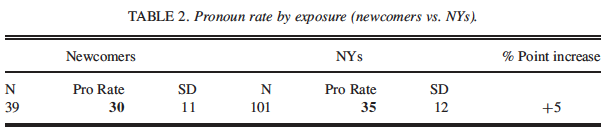
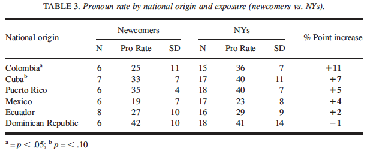
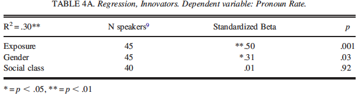

```{r setup, echo = FALSE, include = FALSE, warning = FALSE}
knitr::opts_chunk$set(echo = FALSE, message = FALSE, warning = FALSE)
options(scipen = 999)

library(tidyverse)
library(knitr)
```

# Background Literature

+ Gender and social class as relevant predictors of language change in monolingual settings (Eckert, 1989; Labov, 2001). It tends to be led by:
  + Working or lower middle class people.
  + Women.
  
+ Scarcity of research about language change in immigrant bilingual settings. 

+ It has been suggested that language change in bilingual settings is driven by:
  + People who are most proficient in the majority language.
  + People who have the least contact with other speakers of the minority language.

+ Some studies have actually shown that the leaders of change are:
  + People of high socioeconomic status (Orozco, 2007).
  + Women (Alfaraz, 2010).

---
<br>
+ Foundation of the present study: Otheguy & Zentella (2012).
  + Investigated the social, grammatical, and discourse-communicative factors that condition the use of pronouns.
  
  + "Some evidence" for the impact of social class and gender on changes in pronominal use in Spanish in NYC among Caribbeans and Mainlanders. 
  
  + Effects of class and gender on pronoun rates only among Mainlanders.
      
      **&rarr;** Does the national origin (i.e., specific country of origin) have an influence on the use of the Spanish subject pronouns?


+ Differences of pronoun rates between Spanish and English: pro-drop vs non-pro-drop.

---
# Research Questions

+ Not explicit. 

+ We could formulate them as follows:

  1. How does national origin impact the variable use of subject pronouns in NYC Spanish?

  2. Does social class impact the variable use of subject pronouns in NYC Spanish in the national groups undergoing the most and the least change?

  3. Does gender impact the variable use of subject pronouns in NYC Spanish in the national groups undergoing the most and the least change?

---
# Methodology
### **Participants**
+ 140 participants divided by exposure into two categories:
  + Newcomers, NCs (n = 39):
      + Arrived in NYC at age 17 or older.
      + No more than 5 years in NYC.
  + New Yorkers, NYs (n = 101):
      + Born in NYC, arrived at age 16 or before, or arrived at age 17 or after.
      + Have lived in NYC for more than 5 years.

National Origin    | Newcomers | New Yorkers | Total
---------------    | --------- | ----------- | -----
Colombia           |     6     |     15      |  21  
Cuba               |     7     |     17      |  24  
Dominican Republic |     6     |     18      |  24  
Ecuador            |     8     |     16      |  24  
Mexico             |     6     |     17      |  23  
Puerto Rico        |     6     |     18      |  24  
Total              |    39     |     101     |  140 

<br>
  _¿Esta diferencia (n) podría haber impactado los resultados de algún modo? Argumentan esta diferencia diciendo que en cada país hay una cantidad parecida o igual si se miran dentro del gran grupo (NCs vs NYs). Is this argument enough?_
  
---

<br> 

### **Data**
+ Interviews from the Otheguy-Zentella corpus:
  + Tokens of all tensed verbs that make animate references and that
      + Occur with a subject pronoun but could have occurred without one.
        
          Example: _*Yo* veo varias novelas._
        
      + Are found without a pronoun but could have been found with one.
        
          Example: _Porque es lo único que *ø* me entretengo._
        
  + In other words, they examine the tensed verbs in contexts where pronoun usage is variable. 

---
# Analysis
**Exposure and pronoun rates* in NYC**
+ To compare the pronoun rates between NCs and NYs.
+ One-way ANOVA.
+ Result: The difference of pronoun rate across the groups is significant, with a medium effect size. 

**Exposure, national origin, and pronoun rates in NYC**
+ To compare the pronoun rates of NCs to NYs separately for each national group.
+ Six two-way ANOVAS (one for each national group).
+ Results: 
  + Colombians and Cubans are the groups that change the most (_innovative_). This change is statistical significant. 
  + Dominicans are the group that change the least (_conservatives_). 
+ Effect size testing for Colombians and for Cubans using Cohen's _d_.  
<br>

_*Pronoun rate: the percentage of verb tokens that occur with a pronoun out of all verb tokens._
---
**Impact of social class and gender on pronoun rates**
+ To measure the effects of the predictors on the pronoun rates. 

+ Multiple linear regression:
  + Dependent variable: Pronoun rates.
  + Independent variables: 
      + Exposure: NCs vs NYs.
      + Gender: Males vs Females.
      + Social Class: Middle vs Working class.
      + Education: High school (or less) vs College (or more).
      + English: Poor/Passable skills vs Good/Excellent (self-reported).

+ They analize each predictor as a whole group (NCs + NYs), and for NC innovators and NY innovators separately.

+ To avoid collinearity, they do not include overlapping predictors in the same model, i.e. Exposure-English and Social Class-Education.

+ Models:
  + Pronoun Rate ~ Exposure + Gender + Social Class
  + Pronoun Rate ~ Exposure + Gender + Education
  + Pronoun Rate ~ English + Gender + Social Class
  + Pronoun Rate ~ English + Gender + Education

---

+ Results for innovators: 
  + Main effects are found on exposure, English, and gender.
  + No effects for social class and education. 

+ Results for conservatives: No effects for any of the predictors. 

<br>
**Impact of gender on pronoun rates in NY innovators**
+ In the previous analysis a main effect of gender is found among innovators **&rarr;** They want to explore the possibility of a women effect.

+ In Otheguy and Zentella (2012), which serves as foundation of the present study, significant gender effects were found among Mainlander NYs who arrived after age 3.

+ One-way ANOVA:
  + Data from innovator NYs who arrived before age 3 is excluded
    **&rarr;** Creation of a new subgroup called "established immigrants"

+ Result: Female established-immigrants innovators produce higher rates of pronouns (41%) than the males (31%). This difference is significant.

---
# Appropriateness of Analysis
+ The authors explain and argue the model they use to fit the data and the variables included. 

+ They also explain the values they report, for example, what information does the R-squared provides or what does the standardized betas mean. 

+ They do not include information about how they assess main effects and interactions.

+ I assume they do not test interactions between predictors. If they do, they do not report it. 

+ As for the analysis _per se_, they decide to perform a total of 8 ANOVAS and multiple linear regressions. 

+ ANOVA is probably not the appropriate method considering that it does random assignment (here it contradicts the data!). 

+ All predictors are treated as categorical, but some of them are continuous in nature (e.g., years of exposure). This could reduce the statistical power. 

---
<br>

+ Instead, a better option would have been using a general linear model and nested model comparisons. 

+ The multiple linear regression is an appropriate (and convinient) way of measuring the effects of several predictors concurrently.
---
# Presentation of Results
+ The authors explain the results in a very simple and understandable way. 
  + I remember reading it in my first semester and I understood everything the first time!

+ When explaining and interpreting the results from the ANOVA, they report de _p_ value and the F-ratio. They add the SD in the tables and the Cohen's _d_ if they report the effect size.

+ When explaining and interpreting the results from the multiple linear regression, the authors report de _p_ value, the R-squared and the standardized betas (predictive power of occurrence of the dependent variable).

+ The results are presented through tables; there are no plots. 

+ In general, the tables are easy to interpret, but, in my opinion, a plot (e.g., box plot) would have been a better option in some parts. 

---
<br>
+ Examples of tables: 

```{r, table2, fig.height=1.5}

```


```{r, table3, fig.height=1.5}

```

---
```{r, table4, fig.height=1.5}

```
<br>
<br> 
+ I am, however, a little bit skeptic with the interpretation of the results in the discussion part and the arguments they give to support why Colombians and Cubans are undergoing the most change. 

+ They argue, citing sources not reported in the literature review, that the change in the pronoun rates can be explained by the socioeconomic status and social networks. However:

  + This kind of data is not included in their analysis.
  
  + No effects of social class and education on pronoun rates. 
  
  + Their arguments are supported by studies not cited in the literature review, but in the discussion section.
 

---
# What I (dis)liked
+ I do not like the categorization of exposure in "Newcomers" vs "New Yorkers".
  
  + It does not capture the real experience of the participants. 
  
  + The linguistic experiences of someone who was born in NYC vs someone who moved there when they were 16 can be substantially different (but they are in the same group!!). 
  
  + Why do not quantify their NYC experience based on their age? For example, they have spent 30% of their life in NYC. 
  
  + Another aspect that could support my point is the ANOVA to test if there is a woman effect, but only among "established immigrants". 
      
      + Their argument: In Otheguy and Zentella (2012) gender effects were found in those people who arrived in NYC after age 3. 
      
      + It is only reported in the middle of the analysis and not in the literature review.

---
<br>
+ All predictors are treated as categorical, although some could be continuous.   
  + Why this decision? 

+ The age of the participants (or at least the mean) is not reported. 
  
  + Age as a relevant sociolinguistic variable (Roels & Enghels, 2020)
  
  + Couldn't it be that the women in this study were, for some reason, younger than the men? 
  
  + Couldn't we find an interaction between gender and age?

+ About gender, which is a main predictor:
  
  + How many women and men participated in the study? 
  
  + Is the gender balanced in each exposure and national group?

---
<br>
+ About the inclusion of Cubans in the innovator group:
  
  + Arguments:
  
      + To avoid type II errors.
      
      + "A _p_ value of between .05 and .10 can reflect a true relationship between variables holding in the New York population" (p. 436). 
 
  + Why then disregard Puerto Ricans (p = .10)?
 
  + Is this decision theoretically motivated? Do they conduct further analysis?
  
+ I like that:

  + the methods used to analyze the data are argued. 
  
  + the results are reported in a clear way that it is easy to understand, even though if the reader is not an expert in sociolinguistics. 

---
# References
Alfaraz, G. (2010). The influence of social factors on Spanish dialect contact in the U.S.: A look at Mexican and Cuban Spanish in a Midwestern city. _Southwest Journal of Linguistics_, _29_(2), 27-54. 

Eckert, P. (1989). _Jocks and burnouts: Social categories and identity in the high school_. Teachers College Press. 

Labov, W. (2001). _Principles of linguistic change: Social factors_. Blackwell.

Orozco, R. (2007). Social constraints on the expression of futurity in Spanish-Speaking urban communities. in J. Holmquist, A. Lorenzino & L. Sayahi (eds.), _Selected proceedings of the Third Worshop on Spanish Sociolinguistics_, 103-112. Cascadilla Proceedings Project.

Otheguy, R. & Zentella, A.C. (2012). _Spanish in New York: Language contact, dialectal leveling, and structural continuity_. Oxford University Press.

Shin, N. L. & Otheguy, R. (2013). Social class and gender impacting change in bilingual settings: Spanish subject pronoun use in New York. _Language in Society_, _42_(4), 429-452.


